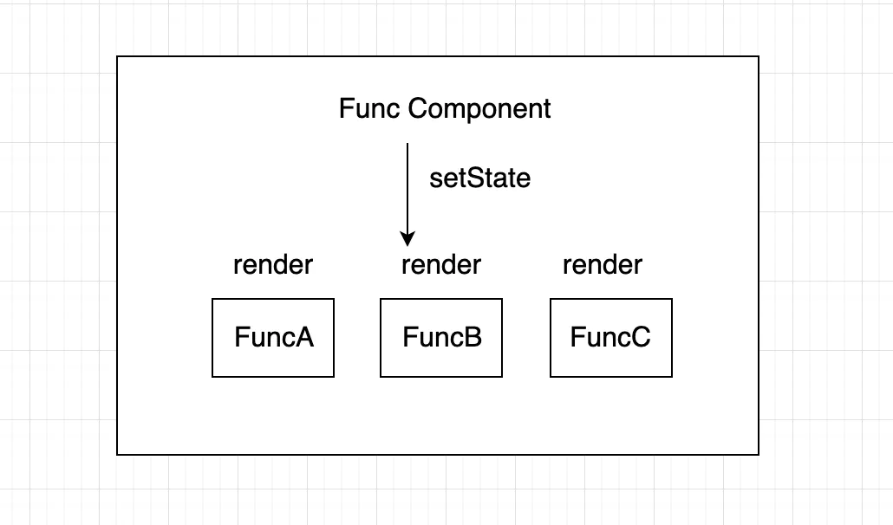

## useDebugValue
...(配合react dev tools调试用的）

## useReducer
... (如果熟悉 Redux 的话，就知道它怎么使用)

## useMemo
前言一下：

使用hooks和函数组件编写我们的组件时，第一个要考虑的就是渲染性能，如果在不做任何处理时，在函数组件中使用setState都会导致组件内部重新渲染，一个比较典型的场景：

所以，一般我会用 `memo` 包裹一下组件，达到类似于class组件的 `pureComponent` 作用。<br/>
但是，当遇到 组件用到了容器组件的某个 **引用类型** 的变量或者 **函数** ，那么当容器内部的state更新之后，这些变量和函数都会重新赋值，浅对比无法判断，这样就会导致即使子组件使用了`memo` 包裹也还是会重新渲染。<br/>
此时，会用到 `useMemo` 和 `useCallback`
```js
//返回 一个被缓存的值
const memoizedValue = useMemo(() => computeExpensiveValue(a, b), [a, b])
```
**useMemo** 用于**缓存**计算结果的**值**、优化性能
* 调用setState，就会触发组件的重新渲染，无论前后的state是否不同
* 父组件更新，子组件也会自动的更新
* 在函数组件中，react不再区分mount和update两个状态，这意味着函数组件的每一次调用都会执行其内部的所有逻辑，那么会带来较大的性能损耗。因此useMemo 或是 useCallback就是解决性能问题的杀手锏。

```js
import React, {useState,useMemo} from 'react'

export default function Example() {
    const [count, setCount] = useState(1);
    const [val, setValue] = useState('');

    // 不用的话，val和count任意变化，都会计算getNum
    const getNum=()=> {
        console.log('每次都要来 执行这个昂贵的计算')
        return Array.from({length: count * 100}, (v, i) => i).reduce((a, b) => a+b)
    }

    // 用的话，val随意变化，都不会计算getNum,返回上一次计算的结果
    // 只有当依赖项 count 变化，才会计算getNum
    const getNum = useMemo(() => {
        console.log('每次都要来 执行这个昂贵的计算')
        return Array.from({length: count * 100}, (v, i) => i).reduce((a, b) => a+b)
    }, [count])

    return <div>
        <h4>总和：{getNum()}</h4>
        <div>
            <button onClick={() => setCount(count + 1)}>+1</button>
            <input value={val} onChange={event => setValue(event.target.value)}/>
        </div>
    </div>;
}
```
```js
import React, { useState, useMemo, memo } from 'react';

const Child = memo(({ data }) => {
  console.log('child render...', data.name);
  return (
    <div>
      <div>child</div>
      <div>{data.name}</div>
    </div>
  );
});

const Hook = () => {
  console.log('Hook render...');
  const [count, setCount] = useState(0);
  const [name, setName] = useState('rose');

  //不使用useMemo的话，每次创建出来的是一个新的对象,Child会render
  // const data = { name };
  // 使用useMemo的话每次对象只创建一次，所以当count改变的时候，Child不会render
  const data = useMemo(() => {
    return {
      name
    };
  }, [name]);

  return (
    <div>
      <div>{count}</div>
      <button onClick={() => setCount(count + 1)}>update count </button>
      <Child data={data} />
    </div>
  );
};
export default Hook;

```
[代码演示地址](https://stackblitz.com/edit/react-w73mz2?file=src%2FApp2.js)


## useCallback
返回 一个被缓存的函数
```js
const fnA = useCallback(fnB, [a])
```
**useCallback** 计算结果是 函数, 主要用于 **缓存函数**

useCallback会将我们传递给它的函数fnB返回，并且将这个结果缓存；当依赖a变更时，会返回新的函数。既然返回的是函数，我们无法很好的判断返回的函数是否变更，所以我们可以借助ES6新增的数据类型Set来判断

```js
import React, { useState, useCallback } from 'react';

const set = new Set();

export default function Callback() {
  const [count, setCount] = useState(1);
  const [val, setVal] = useState('');

//返回缓存的函数
  const callback = useCallback(() => {
    console.log(count);
  }, [count]);

//每次都返回新的函数
  // const callback = () => {
  //   console.log(count);
  // };

  set.add(callback);

  return (
    <div>
      <h4>{count}</h4>
      <h4>{set.size}</h4>
      <div>
        <button onClick={() => setCount(count + 1)}>+</button>
        <input value={val} onChange={event => setVal(event.target.value)} />
      </div>
    </div>
  );
}

```
使用场景：有一个父组件，其中包含子组件，子组件接收一个函数作为props；通常而言，如果父组件更新了，子组件也会执行更新；但是大多数场景下，更新是没有必要的，我们可以借助useCallback来返回函数，然后把这个函数作为props传递给子组件；这样，子组件就能避免不必要的更新
```js
import React, { useState, useCallback, memo } from 'react';

const Child = memo(({data, onChange}) =>{
    console.log('child render...')
    return (
        <div>
            <div>child</div>
            <div>{data}</div>
            <input type="text" onChange={onChange}/>
        </div>
    );
})

const Hook =()=>{
    console.log('Hook render...')
    const [count, setCount] = useState(0)
    const [name, setName] = useState('rose')
    const [text, setText] = useState('')

   //useCallback同理，当count改变时，代码执行到这里时，会再次创建一个新的onChange函数，所以Child组件也会再次render
   const onChange=(e)=>{
        setText(e.target.value)
   }

   //使用useCallback后,count改变，Child不会再次render
   const onChange = useCallback((e)=>{
       setText(e.target.value)
   },[])

    return(
        <div>
            <div>count: {count}</div>
            <div>text : {text}</div>
            <button onClick={()=>setCount(count + 1)}>count + 1</button>
            <Child data={name} onChange={onChange}/>
        </div>
    )
}
export default Hook;
```

> 总结一下：useMemo 和 useCallback 接收的参数都是一样,第一个参数为回调 第二个参数为要依赖的数据
>- 共同作用：
>   -  仅仅 依赖数据 发生变化, 才会重新计算结果，也就是起到缓存的作用。
>- 两者区别：
>   -  useMemo 计算结果是 return 回来的值, 主要用于 缓存计算结果的值 ，应用场景如： 需要 计算的状态
>   -  useCallback 计算结果是 函数, 主要用于 缓存函数，应用场景如: 需要缓存的函数，因为函数式组件每次任何一个 state 的变化 整个组件 都会被重新刷新，一些函数是没有必要被重新刷新的，此时就应该缓存起来，提高性能，和减少资源浪费。

## useLayoutEffect
处理**DOM**的时候用的，比如：改变页面的样式。
**useLayoutEffect** 里面的**callback** 函数会在DOM更新完成后立即执行,但是会在浏览器进行任何绘制之前运行完成,**阻塞了浏览器的绘制**.
```js
//当count为0时生成个随机数字：
import React, { useState, useEffect, useLayoutEffect } from 'react';

export default function App() {
  const [count, setCount] = useState(0);

//useEffect 会闪烁
//useLayoutEffect 会卡顿

  useEffect(() => {
    console.log(`useEffect - count=${count}`);
    // 耗时的操作
    const pre = Date.now();
    while (Date.now() - pre < 500) {}

    // count为0时重新生成个随机数
    if (count === 0) {
      setCount(10 + Math.random() * 200);
    }
  }, [count]);

  // 点击DIV重置count
  return <div onClick={() => setCount(0)}>{count}</div>;
}
```

>总结一下
>- useEffect 在浏览器 **渲染完成** 后执行
>- useLayoutEffect 在浏览器 **渲染前** 执行
>- useLayoutEffect 非必须（**要修改DOM并且不让用户看到修改DOM的过程**），别使用，否则页面比较卡

## useRef
。。。。(管理DOM，存放任意变量，改变不会引发组件重新渲染，等等。。 不赘述。。。)


## useImperativeHandle
可在使用 `ref` 时，自定义暴露给父组件的实例值。配合` forwardRef `一起使用：

```js
//官网栗子：
function FancyInput(props, ref) {
  const inputRef = useRef();
  useImperativeHandle(ref, () => ({
    focus: () => {
      inputRef.current.focus();
    }
  }));
  return <input ref={inputRef} ... />;
}
FancyInput = forwardRef(FancyInput);
```
#### 一般使用场景
* 子组件调用父组件的方法：props一个函数，
* 父组件调用子组件的方法：排上用场
* 栗子：send-web (日期选择)

#### 复杂点的使用场景：分步+Tab型 表单提交
* html5 `hidden` 属性,动态显示和隐藏DOM节点
* 每一步当做一个独立子组件、可调用`form`并获取表单值
* 子组件通过`forwardRef` 获取父组件传递的`ref`
* 子组件通过`useImperativeHandle`方法，暴露给父组件一个自定义方法(可返回一个promise对象)
* 父组件调用`ref.currrent`获取子组件实例(可用aync await转为同步、分步校验表单、节约线程)
* 栗子：kubao-sop、微信红包-商户版

注意：使用 `antd` 的 `Form.create()` 包装子组件之后，在父组件中要将 `ref` 属性改成 `wrappedComponentRef`
```js
<ChildInput label={'名称'} wrappedComponentRef={childRef} />
```


----
----
----
----
----
~~开讲啦~~

